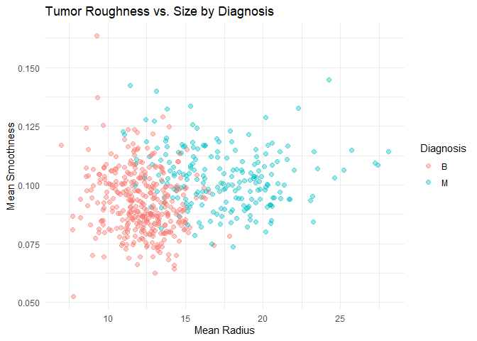
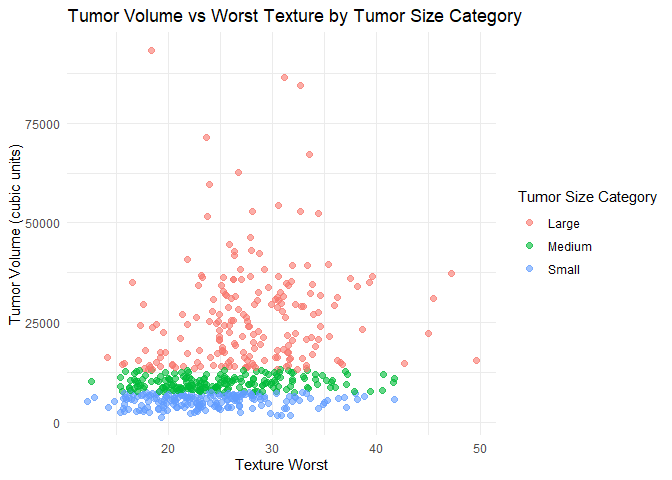
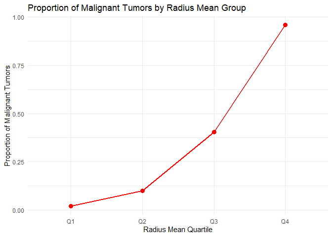
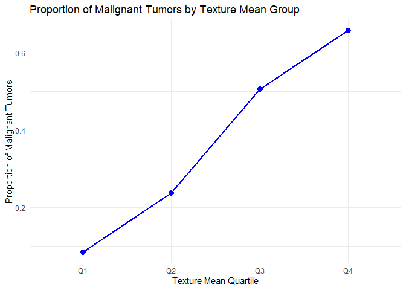
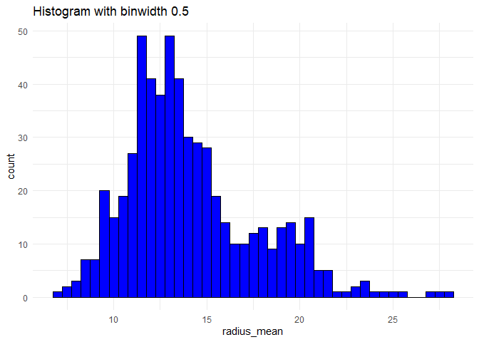
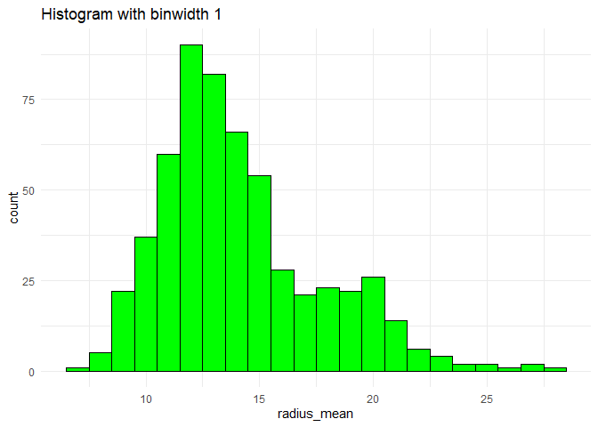
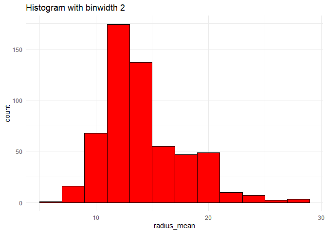

Mini Data Analysis Milestone 2
================

*To complete this milestone, you can edit [this `.rmd`
file](https://github.com/UBC-STAT/STAT545.github.io/blob/main/content/mini-data-analysis/mini-project-2.Rmd)
directly. Fill in the sections that are commented out with
`<!--- start your work here--->`. When you are done, make sure to knit
to an `.md` file by changing the output in the YAML header to
`github_document`, before submitting a tagged release on canvas.*

# Welcome to the rest of your mini data analysis project!

In Milestone 1, you explored your data. and came up with research
questions. This time, we will finish up our mini data analysis and
obtain results for your data by:

- Making summary tables and graphs
- Manipulating special data types in R: factors and/or dates and times.
- Fitting a model object to your data, and extract a result.
- Reading and writing data as separate files.

We will also explore more in depth the concept of *tidy data.*

**NOTE**: The main purpose of the mini data analysis is to integrate
what you learn in class in an analysis. Although each milestone provides
a framework for you to conduct your analysis, it’s possible that you
might find the instructions too rigid for your data set. If this is the
case, you may deviate from the instructions – just make sure you’re
demonstrating a wide range of tools and techniques taught in this class,
and indicate *why* you had to deviate. Feel free to contact the
instructor in these cases.

# Instructions

**To complete this milestone**, edit [this very `.Rmd`
file](https://github.com/UBC-STAT/STAT545.github.io/blob/main/content/mini-data-analysis/mini-project-2.Rmd)
directly. Fill in the sections that are tagged with
`<!--- start your work here--->`.

**To submit this milestone**, make sure to knit this `.Rmd` file to an
`.md` file by changing the YAML output settings from
`output: html_document` to `output: github_document`. Commit and push
all of your work to your mini-analysis GitHub repository, and tag a
release on GitHub. Then, submit a link to your tagged release on canvas.

**Points**: This milestone is worth 50 points: 45 for your analysis, and
5 for overall reproducibility, cleanliness, and coherence of the Github
submission.

**Research Questions**: In Milestone 1, you chose four research
questions to focus on. Wherever realistic, your work in this milestone
should relate to these research questions whenever we ask for
justification behind your work. In the case that some tasks in this
milestone don’t align well with one of your research questions, feel
free to discuss your results in the context of a different research
question.

# Learning Objectives

By the end of this milestone, you should:

- Understand what *tidy* data is, and how to create it using `tidyr`.
- Generate a reproducible and clear report using R Markdown.
- Manipulating special data types in R: factors and/or dates and times.
- Fitting a model object to your data, and extract a result.
- Reading and writing data as separate files.

# Setup

Begin by loading your data and the tidyverse package below:

``` r
library(datateachr) # <- might contain the data you picked!
library(tidyverse)
```

# Task 1: Process and summarize your data

From Milestone 1, you should have an idea of the basic structure of your
dataset (e.g. number of rows and columns, class types, etc.). Here, we
will start investigating your data more in-depth using various data
manipulation functions.

### 1.1 (1 point)

First, write out the 4 research questions you defined in milestone 1
were. This will guide your work through milestone 2:

<!-------------------------- Start your work below ---------------------------->

1.  *How does the roughness of a tumor differ between harmless and
    harmful tumors?*
2.  *Does the overall size of a tumor relate to whether it is harmless
    or harmful?*
3.  *Are there any extreme values in tumor measurements that almost
    always indicate a harmful tumor?*
4.  *Which features together give the clearest distinction between
    harmless and harmful tumors?*
    <!----------------------------------------------------------------------------->

Here, we will investigate your data using various data manipulation and
graphing functions.

### 1.2 (8 points)

Now, for each of your four research questions, choose one task from
options 1-4 (summarizing), and one other task from 4-8 (graphing). You
should have 2 tasks done for each research question (8 total). Make sure
it makes sense to do them! (e.g. don’t use a numerical variables for a
task that needs a categorical variable.). Comment on why each task helps
(or doesn’t!) answer the corresponding research question.

Ensure that the output of each operation is printed!

Also make sure that you’re using dplyr and ggplot2 rather than base R.
Outside of this project, you may find that you prefer using base R
functions for certain tasks, and that’s just fine! But part of this
project is for you to practice the tools we learned in class, which is
dplyr and ggplot2.

**Summarizing:**

1.  Compute the *range*, *mean*, and *two other summary statistics* of
    **one numerical variable** across the groups of **one categorical
    variable** from your data.
2.  Compute the number of observations for at least one of your
    categorical variables. Do not use the function `table()`!
3.  Create a categorical variable with 3 or more groups from an existing
    numerical variable. You can use this new variable in the other
    tasks! *An example: age in years into “child, teen, adult, senior”.*
4.  Compute the proportion and counts in each category of one
    categorical variable across the groups of another categorical
    variable from your data. Do not use the function `table()`!

**Graphing:**

6.  Create a graph of your choosing, make one of the axes logarithmic,
    and format the axes labels so that they are “pretty” or easier to
    read.
7.  Make a graph where it makes sense to customize the alpha
    transparency.

Using variables and/or tables you made in one of the “Summarizing”
tasks:

8.  Create a graph that has at least two geom layers.
9.  Create 3 histograms, with each histogram having different sized
    bins. Pick the “best” one and explain why it is the best.

Make sure it’s clear what research question you are doing each operation
for!

<!------------------------- Start your work below ----------------------------->

> **Question 1:** How does the roughness of a tumor differ between
> harmless and harmful tumors?

Q1.1 Count number of tumors by diagnosis category （Task 2)

``` r
cancer_sample %>%
  group_by(diagnosis) %>%
  summarize(count = n())
```

    ## # A tibble: 2 × 2
    ##   diagnosis count
    ##   <chr>     <int>
    ## 1 B           357
    ## 2 M           212

This shows size of tumors in the dataset are benign (B) versus malignant
(M). It can help us understand the sample sizes respectively.

Q1.2 Scatter plot with alpha transparency（Task 7)

``` r
ggplot(cancer_sample, aes(x = radius_mean, y = smoothness_mean, color = diagnosis)) +
  geom_point(alpha = 0.4, size = 2) +
  labs(title = "Tumor Roughness vs. Size by Diagnosis",
       x = "Mean Radius",
       y = "Mean Smoothness",
       color = "Diagnosis") +
  theme_minimal()
```

<!-- -->

We can visually assess whether the roughness trends differ between
benign and malignant tumors in the scatter plot; and compare them with
the radius.

> **Question 2:** Does the overall size of a tumor relate to whether it
> is harmless or harmful?

Q2.1 Create a categorical variable with 3 or more groups （Task 3)

``` r
cancer_sample <- cancer_sample %>%
  mutate(tumor_volume = (4/3) * pi * (radius_mean^3)) 

cancer_sample <- cancer_sample %>%
  mutate(
    tumor_size_cat = case_when(
      tumor_volume < quantile(tumor_volume, 0.33) ~ "Small",
      tumor_volume < quantile(tumor_volume, 0.66) ~ "Medium",
      TRUE ~ "Large"
    )
  )

cancer_sample %>%
  count(tumor_size_cat)
```

    ## # A tibble: 3 × 2
    ##   tumor_size_cat     n
    ##   <chr>          <int>
    ## 1 Large            194
    ## 2 Medium           187
    ## 3 Small            188

Create a new grouped categorical variable from an existing numeric
variable. Select tumor_volume to generate three categories: small,
medium, and large tumors.

Q2.2 Scatter plot with alpha transparency（Task 7)

``` r
ggplot(cancer_sample, aes(x = texture_worst, y = tumor_volume, color = tumor_size_cat)) +
  geom_jitter(width = 0.2, height = 0, alpha = 0.6, size = 2) + 
  labs(
    title = "Tumor Volume vs Worst Texture by Tumor Size Category",
    x = "Texture Worst",
    y = "Tumor Volume (cubic units)",
    color = "Tumor Size Category"
  ) +
  theme_minimal()
```

<!-- -->

This graph allows us to observe the relationship between tumor size
categories and the worst tumor texture values, and can also assist in
determining whether tumor volume correlates with malignancy/benignity.
We can clearly see that the three groups of large, medium, and small
tumor volumes are highly correlated with malignancy and benignity.

> **Question 3:** Are there any extreme values in tumor measurements
> that almost always indicate a harmful tumor?

Q3.1 Calculate the proportion and number of malignant tumors in each
quartile for each numerical variable. （Task 4)

``` r
cancer_sample <- cancer_sample %>%
  mutate(
    radius_group = case_when(
      radius_mean < quantile(radius_mean, 0.25) ~ "Q1",
      radius_mean < quantile(radius_mean, 0.5)  ~ "Q2",
      radius_mean < quantile(radius_mean, 0.75) ~ "Q3",
      TRUE ~ "Q4"
    ),
    texture_group = case_when(
      texture_mean < quantile(texture_mean, 0.25) ~ "Q1",
      texture_mean < quantile(texture_mean, 0.5)  ~ "Q2",
      texture_mean < quantile(texture_mean, 0.75) ~ "Q3",
      TRUE ~ "Q4"
    )
  )
```

``` r
radius_summary <- cancer_sample %>%
  group_by(radius_group) %>%
  summarise(
    total = n(),
    malignant_count = sum(diagnosis == "M"),
    malignant_prop = malignant_count / total
  )

radius_summary
```

    ## # A tibble: 4 × 4
    ##   radius_group total malignant_count malignant_prop
    ##   <chr>        <int>           <int>          <dbl>
    ## 1 Q1             142               3         0.0211
    ## 2 Q2             142              14         0.0986
    ## 3 Q3             141              57         0.404 
    ## 4 Q4             144             138         0.958

``` r
texture_summary <- cancer_sample %>%
  group_by(texture_group) %>%
  summarise(
    total = n(),
    malignant_count = sum(diagnosis == "M"),
    malignant_prop = malignant_count / total
  )

texture_summary
```

    ## # A tibble: 4 × 4
    ##   texture_group total malignant_count malignant_prop
    ##   <chr>         <int>           <int>          <dbl>
    ## 1 Q1              141              12         0.0851
    ## 2 Q2              143              34         0.238 
    ## 3 Q3              142              72         0.507 
    ## 4 Q4              143              94         0.657

This will identify the relationship between extreme values and malignant
tumors. The results indicate a strong correlation between tumor
malignancy and tumor size, with the fourth group exhibiting a high
incidence rate of 95.83%.

Q3.2 Create a graph of your choosing （Task 6)

``` r
ggplot(radius_summary, aes(x = radius_group, y = malignant_prop, group = 1)) +
  geom_line(color = "red", linewidth = 1) +
  geom_point(size = 3, color = "red") +
  labs(
    title = "Proportion of Malignant Tumors by Radius Mean Group",
    x = "Radius Mean Quartile",
    y = "Proportion of Malignant Tumors"
  ) +
  theme_minimal()
```

<!-- -->

``` r
ggplot(texture_summary, aes(x = texture_group, y = malignant_prop, group = 1)) +
  geom_line(color = "blue", linewidth = 1) +
  geom_point(size = 3, color = "blue") +
  labs(
    title = "Proportion of Malignant Tumors by Texture Mean Group",
    x = "Texture Mean Quartile",
    y = "Proportion of Malignant Tumors"
  ) +
  theme_minimal()
```

<!-- -->

The trend chart clearly displays which tumor characteristics with
extreme values are almost always malignant, validating the previous
question. It can be concluded that under extreme conditions, the radius
is strongly correlated with malignant tumors.

> **Question 4:** Which features together give the clearest distinction
> between harmless and harmful tumors?

Q4.1 Compute the proportion and counts in each category of one
categorical variable across the groups of another categorical variable
from your data.（Task 4)

``` r
cancer_sample <- cancer_sample %>%
  mutate(
    radius_group = case_when(
      radius_mean < quantile(radius_mean, 1/3) ~ "R1",
      radius_mean < quantile(radius_mean, 2/3) ~ "R2",
      TRUE ~ "R3"
    ),
    smoothness_group = case_when(
      smoothness_mean < quantile(smoothness_mean, 1/3) ~ "S1",
      smoothness_mean < quantile(smoothness_mean, 2/3) ~ "S2",
      TRUE ~ "S3"
    ),
    combined_group = paste(radius_group, smoothness_group, sep = "-")
  )

combined_summary <- cancer_sample %>%
  group_by(combined_group) %>%
  summarise(
    total = n(),
    malignant_count = sum(diagnosis == "M"),
    malignant_prop = malignant_count / total
  )

combined_summary
```

    ## # A tibble: 9 × 4
    ##   combined_group total malignant_count malignant_prop
    ##   <chr>          <int>           <int>          <dbl>
    ## 1 R1-S1             67               0         0     
    ## 2 R1-S2             61               1         0.0164
    ## 3 R1-S3             61               5         0.0820
    ## 4 R2-S1             88               2         0.0227
    ## 5 R2-S2             54              13         0.241 
    ## 6 R2-S3             48              24         0.5   
    ## 7 R3-S1             35              24         0.686 
    ## 8 R3-S2             74              64         0.865 
    ## 9 R3-S3             81              79         0.975

To investigate “which feature combinations best distinguish benign from
malignant tumors,” we selected two continuous variables: tumor radius
and surface roughness.

Radius and roughness were each divided into three groups based on
quartiles, discretizing the continuous variables. Radius groups and
roughness values were combined into new feature combinations, with each
group representing a specific feature combination. The number and
proportion of malignant tumors within each combination group were
counted. By observing these proportions, we could rapidly identify which
feature combinations almost always corresponded to malignant tumors.

Q4.2 Create 3 histograms, with each histogram having different sized
bins. Pick the “best” one and explain why it is the best.（Task 9)

``` r
ggplot(cancer_sample, aes(x = radius_mean)) +
  geom_histogram(binwidth = 0.5, fill="blue", color="black") +
  labs(title="Histogram with binwidth 0.5") +
  theme_minimal()
```

<!-- -->

``` r
ggplot(cancer_sample, aes(x = radius_mean)) +
  geom_histogram(binwidth = 1, fill="green", color="black") +
  labs(title="Histogram with binwidth 1") +
  theme_minimal()
```

<!-- -->

``` r
ggplot(cancer_sample, aes(x = radius_mean)) +
  geom_histogram(binwidth = 2, fill="red", color="black") +
  labs(title="Histogram with binwidth 2") +
  theme_minimal()
```

<!-- -->

When plotting the histogram, we experimented with different bin widths
and found that bin width = 1 achieved the optimal balance between detail
and readability. This histogram clearly shows the distribution of each
feature combination and its correlation with malignant tumors.

<!----------------------------------------------------------------------------->

### 1.3 (2 points)

Based on the operations that you’ve completed, how much closer are you
to answering your research questions? Think about what aspects of your
research questions remain unclear. Can your research questions be
refined, now that you’ve investigated your data a bit more? Which
research questions are yielding interesting results?

<!------------------------- Write your answer here ---------------------------->

> Based on the analyses, we have made significant progress in studying
> parameters associated with tumor malignancy. Regarding tumor
> roughness, we have determined that malignant tumors typically exhibit
> higher roughness values than benign tumors, although some overlap
> exists in the median values. The scatter plot effectively explains
> this relationship. For the correlation between tumor size and
> malignancy, we calculated the number and proportion of malignant
> tumors generated within each size category. The scatter plot shows
> that larger tumors cluster in the upper region, the malignant zone,
> demonstrating that larger tumors are more likely to be malignant.
> Comparing these two parameters reveals a correlation between tumor
> size and malignancy: approximately 97% of large tumors are malignant.

> These findings indicate that both roughness and size are predictors of
> malignancy, with tumor size showing the strongest correlation to
> malignancy. However, some aspects remain unclear. Interactions among
> multiple features (such as texture, density, or smoothness) may
> provide clearer criteria for distinguishing benign from malignant
> cases. Future analyses could employ multivariate modeling or feature
> selection methods to identify the most discriminative combination of
> predictive indicators.

<!----------------------------------------------------------------------------->

# Task 2: Tidy your data

In this task, we will do several exercises to reshape our data. The goal
here is to understand how to do this reshaping with the `tidyr` package.

A reminder of the definition of *tidy* data:

- Each row is an **observation**
- Each column is a **variable**
- Each cell is a **value**

### 2.1 (2 points)

Based on the definition above, can you identify if your data is tidy or
untidy? Go through all your columns, or if you have \>8 variables, just
pick 8, and explain whether the data is untidy or tidy.

<!--------------------------- Start your work below --------------------------->

Show the first 8 columns and a few rows to inspect structure

``` r
cancer_sample %>%
  select(1:8) %>%
  slice(1:16)
```

    ## # A tibble: 16 × 8
    ##          ID diagnosis radius_mean texture_mean perimeter_mean area_mean
    ##       <dbl> <chr>           <dbl>        <dbl>          <dbl>     <dbl>
    ##  1   842302 M                18.0         10.4          123.      1001 
    ##  2   842517 M                20.6         17.8          133.      1326 
    ##  3 84300903 M                19.7         21.2          130       1203 
    ##  4 84348301 M                11.4         20.4           77.6      386.
    ##  5 84358402 M                20.3         14.3          135.      1297 
    ##  6   843786 M                12.4         15.7           82.6      477.
    ##  7   844359 M                18.2         20.0          120.      1040 
    ##  8 84458202 M                13.7         20.8           90.2      578.
    ##  9   844981 M                13           21.8           87.5      520.
    ## 10 84501001 M                12.5         24.0           84.0      476.
    ## 11   845636 M                16.0         23.2          103.       798.
    ## 12 84610002 M                15.8         17.9          104.       781 
    ## 13   846226 M                19.2         24.8          132.      1123 
    ## 14   846381 M                15.8         24.0          104.       783.
    ## 15 84667401 M                13.7         22.6           93.6      578.
    ## 16 84799002 M                14.5         27.5           96.7      659.
    ## # ℹ 2 more variables: smoothness_mean <dbl>, compactness_mean <dbl>

Based on the selected first eight columns of parameters, the data set
appears relatively clean. Each row corresponds to a single tumor
observation from a patient sample. Each column represents a specific
variable value (e.g., radius, texture, smoothness). Each cell contains
only one numerical value. These three characteristics collectively
indicate that the data set is clean.
<!----------------------------------------------------------------------------->

### 2.2 (4 points)

Now, if your data is tidy, untidy it! Then, tidy it back to it’s
original state.

If your data is untidy, then tidy it! Then, untidy it back to it’s
original state.

Be sure to explain your reasoning for this task. Show us the “before”
and “after”.

<!--------------------------- Start your work below --------------------------->

> My data is tidy, untidy it!

Merge tumor_size_cat, radius_mean, diagnosis, and ID into a single cell
named label, which will serve as the patient’s label.

``` r
cancer_sample <- cancer_sample %>%
  mutate(label = paste(tumor_size_cat, radius_mean, diagnosis, sep = "_"))

cancer_sample %>%
  select(ID, label) %>%
  slice(1:16)
```

    ## # A tibble: 16 × 2
    ##          ID label         
    ##       <dbl> <chr>         
    ##  1   842302 Large_17.99_M 
    ##  2   842517 Large_20.57_M 
    ##  3 84300903 Large_19.69_M 
    ##  4 84348301 Small_11.42_M 
    ##  5 84358402 Large_20.29_M 
    ##  6   843786 Medium_12.45_M
    ##  7   844359 Large_18.25_M 
    ##  8 84458202 Medium_13.71_M
    ##  9   844981 Medium_13_M   
    ## 10 84501001 Medium_12.46_M
    ## 11   845636 Large_16.02_M 
    ## 12 84610002 Large_15.78_M 
    ## 13   846226 Large_19.17_M 
    ## 14   846381 Large_15.85_M 
    ## 15 84667401 Medium_13.73_M
    ## 16 84799002 Medium_14.54_M

This step transforms the data from “tidy” to “untidy.” Since variables
that should be separate are now combined into a single column named
label, the principle of one variable per column is no longer satisfied.

> Tidy it back to it’s original state.

Use `arrange(size_order)` to sort patient labels by tumor size, enabling
us to retrieve patient label information based on tumor size. In
clinical settings, medical staff can quickly extract relevant patient
information labels based on size relationships without needing to
compare each one individually.

``` r
cancer_sample_sorted <- cancer_sample %>%
  mutate(size_order = str_sub(label, 1, 1)) %>%   
  mutate(size_order = factor(size_order, levels = c("S", "M", "L"))) %>% # small->medium->large
  arrange(size_order) %>%   
  select(ID, label)         

slice(cancer_sample_sorted, 1:16)
```

    ## # A tibble: 16 × 2
    ##          ID label        
    ##       <dbl> <chr>        
    ##  1 84348301 Small_11.42_M
    ##  2  8510824 Small_9.504_B
    ##  3   853612 Small_11.84_M
    ##  4   855563 Small_10.95_M
    ##  5 85713702 Small_8.196_B
    ##  6   857155 Small_12.05_B
    ##  7   857343 Small_11.76_B
    ##  8   857374 Small_11.94_B
    ##  9 85759902 Small_11.52_B
    ## 10   858477 Small_8.618_B
    ## 11   858970 Small_10.17_B
    ## 12   858981 Small_8.598_B
    ## 13   859196 Small_9.173_B
    ## 14   859464 Small_9.465_B
    ## 15   859465 Small_11.31_B
    ## 16   859471 Small_9.029_B

<!----------------------------------------------------------------------------->

### 2.3 (4 points)

Now, you should be more familiar with your data, and also have made
progress in answering your research questions. Based on your interest,
and your analyses, pick 2 of the 4 research questions to continue your
analysis in the remaining tasks:

<!-------------------------- Start your work below ---------------------------->

1.  *How does the roughness of a tumor differ between harmless and
    harmful tumors?*
2.  *Does the overall size of a tumor relate to whether it is harmless
    or harmful?*

<!----------------------------------------------------------------------------->

Explain your decision for choosing the above two research questions.

<!--------------------------- Start your work below --------------------------->

> These two questions were selected because surface roughness and tumor
> size are the most immediate and easily quantifiable tumor
> characteristics. In clinical research, these two indicators are
> frequently used for preliminary screening and diagnosis of malignant
> tumors. By analysis of tumor surface roughness and volume size,
> doctors can rapidly identify high-risk patients and determine whether
> to proceed with biopsy or other imaging examinations. Moreover,
> roughness and size are easy to measure, making it simpler to establish
> clear patterns in statistical analysis, thus possessing high research
> and application value.
> <!----------------------------------------------------------------------------->

Now, try to choose a version of your data that you think will be
appropriate to answer these 2 questions. Use between 4 and 8 functions
that we’ve covered so far (i.e. by filtering, cleaning, tidy’ing,
dropping irrelevant columns, etc.).

(If it makes more sense, then you can make/pick two versions of your
data, one for each research question.)

<!--------------------------- Start your work below --------------------------->

``` r
analysis_data <- cancer_sample %>%
  select(ID, diagnosis, radius_mean, smoothness_mean, tumor_volume, tumor_size_cat) %>%
  filter(!is.na(radius_mean), !is.na(smoothness_mean), !is.na(tumor_volume)) %>%
  mutate(diagnosis = factor(diagnosis, levels = c("B", "M")),
         tumor_size_cat = factor(tumor_size_cat, levels = c("Small", "Medium", "Large")))

head(analysis_data)
```

    ## # A tibble: 6 × 6
    ##         ID diagnosis radius_mean smoothness_mean tumor_volume tumor_size_cat
    ##      <dbl> <fct>           <dbl>           <dbl>        <dbl> <fct>         
    ## 1   842302 M                18.0          0.118        24388. Large         
    ## 2   842517 M                20.6          0.0847       36458. Large         
    ## 3 84300903 M                19.7          0.110        31976. Large         
    ## 4 84348301 M                11.4          0.142         6239. Small         
    ## 5 84358402 M                20.3          0.100        34989. Large         
    ## 6   843786 M                12.4          0.128         8083. Medium

This code retains the basic information for each sample, including ID,
tumor diagnosis category, tumor size metrics, tumor size classification,
and surface roughness. The categorical variables are set as factor types
to facilitate subsequent analysis. These retained variables will help us
investigate the relationship between tumor size and roughness with
malignancy.
<!----------------------------------------------------------------------------->

# Task 3: Modelling

## 3.0 (no points)

Pick a research question from 1.2, and pick a variable of interest
(we’ll call it “Y”) that’s relevant to the research question. Indicate
these.

<!-------------------------- Start your work below ---------------------------->

**Research Question**: Does the overall size of a tumor relate to
whether it is harmless or harmful?

**Variable of interest**: Tumor area, `tumor_volume`

<!----------------------------------------------------------------------------->

## 3.1 (3 points)

Fit a model or run a hypothesis test that provides insight on this
variable with respect to the research question. Store the model object
as a variable, and print its output to screen. We’ll omit having to
justify your choice, because we don’t expect you to know about model
specifics in STAT 545.

- **Note**: It’s OK if you don’t know how these models/tests work. Here
  are some examples of things you can do here, but the sky’s the limit.

  - You could fit a model that makes predictions on Y using another
    variable, by using the `lm()` function.
  - You could test whether the mean of Y equals 0 using `t.test()`, or
    maybe the mean across two groups are different using `t.test()`, or
    maybe the mean across multiple groups are different using `anova()`
    (you may have to pivot your data for the latter two).
  - You could use `lm()` to test for significance of regression
    coefficients.

<!-------------------------- Start your work below ---------------------------->

``` r
Y <- "tumor_volume"

tumor_size_model <- lm(tumor_volume ~ diagnosis, data = cancer_sample)

summary(tumor_size_model)
```

    ## 
    ## Call:
    ## lm(formula = tumor_volume ~ diagnosis, data = cancer_sample)
    ## 
    ## Residuals:
    ##    Min     1Q Median     3Q    Max 
    ## -19117  -3952   -640   2784  68424 
    ## 
    ## Coefficients:
    ##             Estimate Std. Error t value Pr(>|t|)    
    ## (Intercept)   7987.2      483.5   16.52   <2e-16 ***
    ## diagnosisM   16629.6      792.1   20.99   <2e-16 ***
    ## ---
    ## Signif. codes:  0 '***' 0.001 '**' 0.01 '*' 0.05 '.' 0.1 ' ' 1
    ## 
    ## Residual standard error: 9135 on 567 degrees of freedom
    ## Multiple R-squared:  0.4374, Adjusted R-squared:  0.4364 
    ## F-statistic: 440.8 on 1 and 567 DF,  p-value: < 2.2e-16

Using tumor volume as the dependent variable and tumor diagnosis
category as the independent variable to establish a linear model enables
quantitative analysis of volume differences across tumor categories. The
mean volume for benign tumors is 7987.2. The mean volume of malignant
tumors was approximately 16,630 units larger than that of benign tumors.
The p-values were all less than 2e-16, indicating highly significant
differences. R² = 0.4374, meaning the diagnostic category explained
approximately 43.7% of the variation in tumor volume. Malignant tumors
exhibited significantly larger volumes than benign tumors, with a very
pronounced difference.
<!----------------------------------------------------------------------------->

## 3.2 (3 points)

Produce something relevant from your fitted model: either predictions on
Y, or a single value like a regression coefficient or a p-value.

- Be sure to indicate in writing what you chose to produce.
- Your code should either output a tibble (in which case you should
  indicate the column that contains the thing you’re looking for), or
  the thing you’re looking for itself.
- Obtain your results using the `broom` package if possible. If your
  model is not compatible with the broom function you’re needing, then
  you can obtain your results by some other means, but first indicate
  which broom function is not compatible.

<!-------------------------- Start your work below ---------------------------->

``` r
library(broom)

broom_model <- glance(tumor_size_model)

broom_model
```

    ## # A tibble: 1 × 12
    ##   r.squared adj.r.squared sigma statistic  p.value    df logLik    AIC    BIC
    ##       <dbl>         <dbl> <dbl>     <dbl>    <dbl> <dbl>  <dbl>  <dbl>  <dbl>
    ## 1     0.437         0.436 9135.      441. 7.80e-73     1 -5996. 11997. 12010.
    ## # ℹ 3 more variables: deviance <dbl>, df.residual <int>, nobs <int>

R² = 0.437 shows that approximately 44% of the variation in tumor volume
is explained, indicating that malignant tumors are typically larger than
benign tumors. This confirms our research question that tumor size
correlates with malignancy. The model’s p-value is extremely low (\<
0.001), demonstrating that the “Diagnosis Type” significantly influences
tumor volume.
<!----------------------------------------------------------------------------->

# Task 4: Reading and writing data

Get set up for this exercise by making a folder called `output` in the
top level of your project folder / repository. You’ll be saving things
there.

## 4.1 (3 points)

Take a summary table that you made from Task 1, and write it as a csv
file in your `output` folder. Use the `here::here()` function.

- **Robustness criteria**: You should be able to move your Mini Project
  repository / project folder to some other location on your computer,
  or move this very Rmd file to another location within your project
  repository / folder, and your code should still work.
- **Reproducibility criteria**: You should be able to delete the csv
  file, and remake it simply by knitting this Rmd file.

<!-------------------------- Start your work below ---------------------------->

``` r
write.csv(radius_summary, 
          file = here::here("output", "radius_summary.csv"), 
          row.names = FALSE)

here::here("output", "radius_summary.csv")
```

    ## [1] "C:/Users/Ricky Zang/Desktop/2025Fall/STAT545/mini-project-1/output/radius_summary.csv"

<!----------------------------------------------------------------------------->

## 4.2 (3 points)

Write your model object from Task 3 to an R binary file (an RDS), and
load it again. Be sure to save the binary file in your `output` folder.
Use the functions `saveRDS()` and `readRDS()`.

- The same robustness and reproducibility criteria as in 4.1 apply here.

<!-------------------------- Start your work below ---------------------------->

``` r
saveRDS(tumor_size_model, file = here::here("output", "tumor_size_model.rds"))

loaded_model <- readRDS(here::here("output", "tumor_size_model.rds"))

summary(loaded_model)
```

    ## 
    ## Call:
    ## lm(formula = tumor_volume ~ diagnosis, data = cancer_sample)
    ## 
    ## Residuals:
    ##    Min     1Q Median     3Q    Max 
    ## -19117  -3952   -640   2784  68424 
    ## 
    ## Coefficients:
    ##             Estimate Std. Error t value Pr(>|t|)    
    ## (Intercept)   7987.2      483.5   16.52   <2e-16 ***
    ## diagnosisM   16629.6      792.1   20.99   <2e-16 ***
    ## ---
    ## Signif. codes:  0 '***' 0.001 '**' 0.01 '*' 0.05 '.' 0.1 ' ' 1
    ## 
    ## Residual standard error: 9135 on 567 degrees of freedom
    ## Multiple R-squared:  0.4374, Adjusted R-squared:  0.4364 
    ## F-statistic: 440.8 on 1 and 567 DF,  p-value: < 2.2e-16

<!----------------------------------------------------------------------------->

# Overall Reproducibility/Cleanliness/Coherence Checklist

Here are the criteria we’re looking for.

## Coherence (0.5 points)

The document should read sensibly from top to bottom, with no major
continuity errors.

The README file should still satisfy the criteria from the last
milestone, i.e. it has been updated to match the changes to the
repository made in this milestone.

## File and folder structure (1 points)

You should have at least three folders in the top level of your
repository: one for each milestone, and one output folder. If there are
any other folders, these are explained in the main README.

Each milestone document is contained in its respective folder, and
nowhere else.

Every level-1 folder (that is, the ones stored in the top level, like
“Milestone1” and “output”) has a `README` file, explaining in a sentence
or two what is in the folder, in plain language (it’s enough to say
something like “This folder contains the source for Milestone 1”).

## Output (1 point)

All output is recent and relevant:

- All Rmd files have been `knit`ted to their output md files.
- All knitted md files are viewable without errors on Github. Examples
  of errors: Missing plots, “Sorry about that, but we can’t show files
  that are this big right now” messages, error messages from broken R
  code
- All of these output files are up-to-date – that is, they haven’t
  fallen behind after the source (Rmd) files have been updated.
- There should be no relic output files. For example, if you were
  knitting an Rmd to html, but then changed the output to be only a
  markdown file, then the html file is a relic and should be deleted.

Our recommendation: delete all output files, and re-knit each
milestone’s Rmd file, so that everything is up to date and relevant.

## Tagged release (0.5 point)

You’ve tagged a release for Milestone 2.
