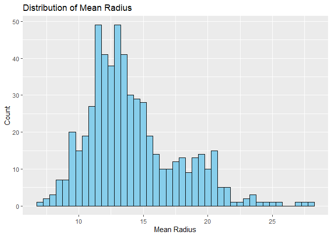
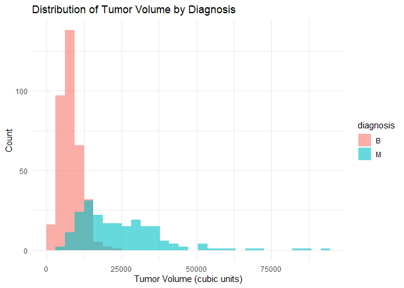
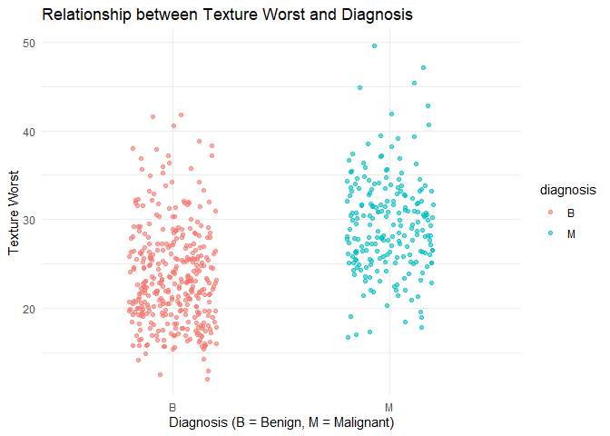
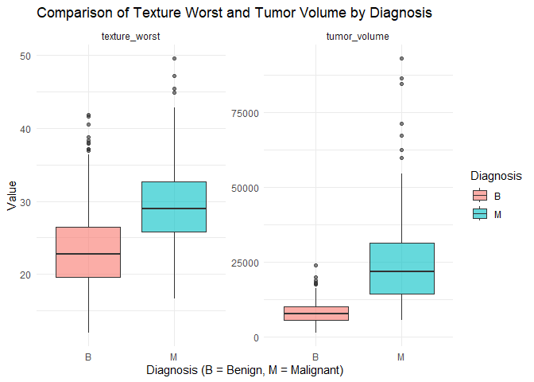

Mini Data-Analysis Deliverable 1
================

# Welcome to your (maybe) first-ever data analysis project!

And hopefully the first of many. Let’s get started:

1.  Install the [`datateachr`](https://github.com/UBC-MDS/datateachr)
    package by typing the following into your **R terminal**:

<!-- -->

    install.packages("devtools")
    devtools::install_github("UBC-MDS/datateachr")

2.  Load the packages below.

``` r
library(datateachr)
library(tidyverse)
```

    ## ── Attaching core tidyverse packages ──────────────────────── tidyverse 2.0.0 ──
    ## ✔ dplyr     1.1.4     ✔ readr     2.1.5
    ## ✔ forcats   1.0.0     ✔ stringr   1.5.2
    ## ✔ ggplot2   4.0.0     ✔ tibble    3.3.0
    ## ✔ lubridate 1.9.4     ✔ tidyr     1.3.1
    ## ✔ purrr     1.1.0     
    ## ── Conflicts ────────────────────────────────────────── tidyverse_conflicts() ──
    ## ✖ dplyr::filter() masks stats::filter()
    ## ✖ dplyr::lag()    masks stats::lag()
    ## ℹ Use the conflicted package (<http://conflicted.r-lib.org/>) to force all conflicts to become errors

3.  Make a repository in the <https://github.com/stat545ubc-2024>
    Organization. You can do this by following the steps found on canvas
    in the entry called [MDA: Create a
    repository](https://canvas.ubc.ca/courses/158528/pages/mda-create-a-repository).
    One completed, your repository should automatically be listed as
    part of the stat545ubc-2024 Organization.

# Instructions

## For Both Milestones

- Each milestone has explicit tasks. Tasks that are more challenging
  will often be allocated more points.

- Each milestone will be also graded for reproducibility, cleanliness,
  and coherence of the overall Github submission.

- While the two milestones will be submitted as independent
  deliverables, the analysis itself is a continuum - think of it as two
  chapters to a story. Each chapter, or in this case, portion of your
  analysis, should be easily followed through by someone unfamiliar with
  the content.
  [Here](https://swcarpentry.github.io/r-novice-inflammation/06-best-practices-R.html)
  is a good resource for what constitutes “good code”. Learning good
  coding practices early in your career will save you hassle later on!

- The milestones will be equally weighted.

## For Milestone 1

**To complete this milestone**, edit [this very `.Rmd`
file](https://raw.githubusercontent.com/UBC-STAT/stat545.stat.ubc.ca/master/content/mini-project/mini-project-1.Rmd)
directly. Fill in the sections that are tagged with
`<!--- start your work below --->`.

**To submit this milestone**, make sure to knit this `.Rmd` file to an
`.md` file by changing the YAML output settings from
`output: html_document` to `output: github_document`. Commit and push
all of your work to the mini-analysis GitHub repository you made
earlier, and tag a release on GitHub. Then, submit a link to your tagged
release on canvas.

**Points**: This milestone is worth 36 points: 30 for your analysis, and
6 for overall reproducibility, cleanliness, and coherence of the Github
submission.

# Learning Objectives

By the end of this milestone, you should:

- Become familiar with your dataset of choosing
- Select 4 questions that you would like to answer with your data
- Generate a reproducible and clear report using R Markdown
- Become familiar with manipulating and summarizing your data in tibbles
  using `dplyr`, with a research question in mind.

# Task 1: Choose your favorite dataset

The `datateachr` package by Hayley Boyce and Jordan Bourak currently
composed of 7 semi-tidy datasets for educational purposes. Here is a
brief description of each dataset:

- *apt_buildings*: Acquired courtesy of The City of Toronto’s Open Data
  Portal. It currently has 3455 rows and 37 columns.

- *building_permits*: Acquired courtesy of The City of Vancouver’s Open
  Data Portal. It currently has 20680 rows and 14 columns.

- *cancer_sample*: Acquired courtesy of UCI Machine Learning Repository.
  It currently has 569 rows and 32 columns.

- *flow_sample*: Acquired courtesy of The Government of Canada’s
  Historical Hydrometric Database. It currently has 218 rows and 7
  columns.

- *parking_meters*: Acquired courtesy of The City of Vancouver’s Open
  Data Portal. It currently has 10032 rows and 22 columns.

- *steam_games*: Acquired courtesy of Kaggle. It currently has 40833
  rows and 21 columns.

- *vancouver_trees*: Acquired courtesy of The City of Vancouver’s Open
  Data Portal. It currently has 146611 rows and 20 columns.

**Things to keep in mind**

- We hope that this project will serve as practice for carrying our your
  own *independent* data analysis. Remember to comment your code, be
  explicit about what you are doing, and write notes in this markdown
  document when you feel that context is required. As you advance in the
  project, prompts and hints to do this will be diminished - it’ll be up
  to you!

- Before choosing a dataset, you should always keep in mind **your
  goal**, or in other ways, *what you wish to achieve with this data*.
  This mini data-analysis project focuses on *data wrangling*,
  *tidying*, and *visualization*. In short, it’s a way for you to get
  your feet wet with exploring data on your own.

And that is exactly the first thing that you will do!

1.1 **(1 point)** Out of the 7 datasets available in the `datateachr`
package, choose **4** that appeal to you based on their description.
Write your choices below:

**Note**: We encourage you to use the ones in the `datateachr` package,
but if you have a dataset that you’d really like to use, you can include
it here. But, please check with a member of the teaching team to see
whether the dataset is of appropriate complexity. Also, include a
**brief** description of the dataset here to help the teaching team
understand your data.

<!-------------------------- Start your work below ---------------------------->

1: *apt_buildings*  
2: *steam_games*  
3: *vancouver_trees*  
4: *cancer_sample*

<!----------------------------------------------------------------------------->

1.2 **(6 points)** One way to narrowing down your selection is to
*explore* the datasets. Use your knowledge of dplyr to find out at least
*3* attributes about each of these datasets (an attribute is something
such as number of rows, variables, class type…). The goal here is to
have an idea of *what the data looks like*.

*Hint:* This is one of those times when you should think about the
cleanliness of your analysis. I added a single code chunk for you below,
but do you want to use more than one? Would you like to write more
comments outside of the code chunk?

<!-------------------------- Start your work below ---------------------------->

## EXPLORE HERE

### Code introduction

``` r
## 1. glimpse(): shows structure of dataset (variable names, types, first values)
## 2. n(): counts number of rows
## 3. ncol(): counts number of columns
## 4. sum(is.na()): counts missing values
```

### apt_buildings

``` r
# ----------- Explore apt_buildings -----------
apt_buildings %>% glimpse()
```

    ## Rows: 3,455
    ## Columns: 37
    ## $ id                               <dbl> 10359, 10360, 10361, 10362, 10363, 10…
    ## $ air_conditioning                 <chr> "NONE", "NONE", "NONE", "NONE", "NONE…
    ## $ amenities                        <chr> "Outdoor rec facilities", "Outdoor po…
    ## $ balconies                        <chr> "YES", "YES", "YES", "YES", "NO", "NO…
    ## $ barrier_free_accessibilty_entr   <chr> "YES", "NO", "NO", "YES", "NO", "NO",…
    ## $ bike_parking                     <chr> "0 indoor parking spots and 10 outdoo…
    ## $ exterior_fire_escape             <chr> "NO", "NO", "NO", "YES", "NO", NA, "N…
    ## $ fire_alarm                       <chr> "YES", "YES", "YES", "YES", "YES", "Y…
    ## $ garbage_chutes                   <chr> "YES", "YES", "NO", "NO", "NO", "NO",…
    ## $ heating_type                     <chr> "HOT WATER", "HOT WATER", "HOT WATER"…
    ## $ intercom                         <chr> "YES", "YES", "YES", "YES", "YES", "Y…
    ## $ laundry_room                     <chr> "YES", "YES", "YES", "YES", "YES", "Y…
    ## $ locker_or_storage_room           <chr> "NO", "YES", "YES", "YES", "NO", "YES…
    ## $ no_of_elevators                  <dbl> 3, 3, 0, 1, 0, 0, 0, 2, 4, 2, 0, 2, 2…
    ## $ parking_type                     <chr> "Underground Garage , Garage accessib…
    ## $ pets_allowed                     <chr> "YES", "YES", "YES", "YES", "YES", "Y…
    ## $ prop_management_company_name     <chr> NA, "SCHICKEDANZ BROS. PROPERTIES", N…
    ## $ property_type                    <chr> "PRIVATE", "PRIVATE", "PRIVATE", "PRI…
    ## $ rsn                              <dbl> 4154812, 4154815, 4155295, 4155309, 4…
    ## $ separate_gas_meters              <chr> "NO", "NO", "NO", "NO", "NO", "NO", "…
    ## $ separate_hydro_meters            <chr> "YES", "YES", "YES", "YES", "YES", "Y…
    ## $ separate_water_meters            <chr> "NO", "NO", "NO", "NO", "NO", "NO", "…
    ## $ site_address                     <chr> "65  FOREST MANOR RD", "70  CLIPPER R…
    ## $ sprinkler_system                 <chr> "YES", "YES", "NO", "YES", "NO", "NO"…
    ## $ visitor_parking                  <chr> "PAID", "FREE", "UNAVAILABLE", "UNAVA…
    ## $ ward                             <chr> "17", "17", "03", "03", "02", "02", "…
    ## $ window_type                      <chr> "DOUBLE PANE", "DOUBLE PANE", "DOUBLE…
    ## $ year_built                       <dbl> 1967, 1970, 1927, 1959, 1943, 1952, 1…
    ## $ year_registered                  <dbl> 2017, 2017, 2017, 2017, 2017, NA, 201…
    ## $ no_of_storeys                    <dbl> 17, 14, 4, 5, 4, 4, 4, 7, 32, 4, 4, 7…
    ## $ emergency_power                  <chr> "NO", "YES", "NO", "NO", "NO", "NO", …
    ## $ `non-smoking_building`           <chr> "YES", "NO", "YES", "YES", "YES", "NO…
    ## $ no_of_units                      <dbl> 218, 206, 34, 42, 25, 34, 14, 105, 57…
    ## $ no_of_accessible_parking_spaces  <dbl> 8, 10, 20, 42, 12, 0, 5, 1, 1, 6, 12,…
    ## $ facilities_available             <chr> "Recycling bins", "Green Bin / Organi…
    ## $ cooling_room                     <chr> "NO", "NO", "NO", "NO", "NO", "NO", "…
    ## $ no_barrier_free_accessible_units <dbl> 2, 0, 0, 42, 0, NA, 14, 0, 0, 1, 25, …

Show the structure of the dataset `apt_buildings`.

``` r
apt_buildings %>% summarise(rows = n(), cols = ncol(.))
```

    ## # A tibble: 1 × 2
    ##    rows  cols
    ##   <int> <int>
    ## 1  3455    37

`rows = 3455` : there are 3455 apartment buildings in the dataset.
`cols = 37` : there are 37 different variables (e.g., address, year
built, number of floors).

``` r
apt_buildings %>% summarise(missing_values = sum(is.na(.)))
```

    ## # A tibble: 1 × 1
    ##   missing_values
    ##            <int>
    ## 1           6286

`missing_values = 6286` : there are 6286 empty/missing data points
across all rows and columns.

Contains both categorical variables (e.g., neighborhood, property type)
and numeric variables (e.g., year built, number of units, building
height). Some missing values are expected because not all buildings
report every feature. For example, older buildings may not have detailed
structural information, or data may be incomplete in the city’s open
data portal.

### building_permits

``` r
# ----------- Explore building_permits -----------
building_permits %>% glimpse()
```

    ## Rows: 20,680
    ## Columns: 14
    ## $ permit_number               <chr> "BP-2016-02248", "BU468090", "DB-2016-0445…
    ## $ issue_date                  <date> 2017-02-01, 2017-02-01, 2017-02-01, 2017-…
    ## $ project_value               <dbl> 0, 0, 35000, 15000, 181178, 0, 15000, 0, 6…
    ## $ type_of_work                <chr> "Salvage and Abatement", "New Building", "…
    ## $ address                     <chr> "4378 W 9TH AVENUE, Vancouver, BC V6R 2C7"…
    ## $ project_description         <chr> NA, NA, NA, NA, NA, NA, NA, NA, NA, NA, NA…
    ## $ building_contractor         <chr> NA, NA, NA, "Mercury Contracting Ltd", "08…
    ## $ building_contractor_address <chr> NA, NA, NA, "88 W PENDER ST  \r\nUnit 2069…
    ## $ applicant                   <chr> "Raffaele & Associates DBA: Raffaele and A…
    ## $ applicant_address           <chr> "2642 East Hastings\r\nVancouver, BC  V5K …
    ## $ property_use                <chr> "Dwelling Uses", "Dwelling Uses", "Dwellin…
    ## $ specific_use_category       <chr> "One-Family Dwelling", "Multiple Dwelling"…
    ## $ year                        <dbl> 2017, 2017, 2017, 2017, 2017, 2017, 2017, …
    ## $ bi_id                       <dbl> 524, 535, 539, 541, 543, 546, 547, 548, 54…

Show the structure of the dataset `building_permits`.

``` r
building_permits %>% summarise(rows = n(), cols = ncol(.))
```

    ## # A tibble: 1 × 2
    ##    rows  cols
    ##   <int> <int>
    ## 1 20680    14

`rows = 20680` : represents 20,680 building permit records. `cols = 14`
: each permit has 14 variables, such as address, application date,
permit status, and type of construction.

``` r
building_permits %>% summarise(missing_values = sum(is.na(.)))
```

    ## # A tibble: 1 × 1
    ##   missing_values
    ##            <int>
    ## 1          26393

`missing_values = 26393` : there are 26393 empty/missing data points
across all rows and columns.

Includes categorical variables (e.g., permit type, permit status) and
dates (application date, issue date), along with some numeric values
(e.g., project value). Many missing values appear because not every
permit includes the same information. For example, permits still under
review may not have a completion date, and some fields may only apply to
specific permit types.

### steam_games

``` r
# ----------- Explore steam_games -----------
steam_games %>% glimpse()
```

    ## Rows: 40,833
    ## Columns: 21
    ## $ id                       <dbl> 1, 2, 3, 4, 5, 6, 7, 8, 9, 10, 11, 12, 13, 14…
    ## $ url                      <chr> "https://store.steampowered.com/app/379720/DO…
    ## $ types                    <chr> "app", "app", "app", "app", "app", "bundle", …
    ## $ name                     <chr> "DOOM", "PLAYERUNKNOWN'S BATTLEGROUNDS", "BAT…
    ## $ desc_snippet             <chr> "Now includes all three premium DLC packs (Un…
    ## $ recent_reviews           <chr> "Very Positive,(554),- 89% of the 554 user re…
    ## $ all_reviews              <chr> "Very Positive,(42,550),- 92% of the 42,550 u…
    ## $ release_date             <chr> "May 12, 2016", "Dec 21, 2017", "Apr 24, 2018…
    ## $ developer                <chr> "id Software", "PUBG Corporation", "Harebrain…
    ## $ publisher                <chr> "Bethesda Softworks,Bethesda Softworks", "PUB…
    ## $ popular_tags             <chr> "FPS,Gore,Action,Demons,Shooter,First-Person,…
    ## $ game_details             <chr> "Single-player,Multi-player,Co-op,Steam Achie…
    ## $ languages                <chr> "English,French,Italian,German,Spanish - Spai…
    ## $ achievements             <dbl> 54, 37, 128, NA, NA, NA, 51, 55, 34, 43, 72, …
    ## $ genre                    <chr> "Action", "Action,Adventure,Massively Multipl…
    ## $ game_description         <chr> "About This Game Developed by id software, th…
    ## $ mature_content           <chr> NA, "Mature Content Description  The develope…
    ## $ minimum_requirements     <chr> "Minimum:,OS:,Windows 7/8.1/10 (64-bit versio…
    ## $ recommended_requirements <chr> "Recommended:,OS:,Windows 7/8.1/10 (64-bit ve…
    ## $ original_price           <dbl> 19.99, 29.99, 39.99, 44.99, 0.00, NA, 59.99, …
    ## $ discount_price           <dbl> 14.99, NA, NA, NA, NA, 35.18, 70.42, 17.58, N…

Show the structure of the dataset `steam_games`.

``` r
steam_games %>% summarise(rows = n(), cols = ncol(.))
```

    ## # A tibble: 1 × 2
    ##    rows  cols
    ##   <int> <int>
    ## 1 40833    21

`rows ≈ 40,833` : represents 40,833 different games. `cols ≈ 21` : each
game has 21 attributes, such as title, release date, price, developer,
and player ratings.

``` r
steam_games %>% summarise(missing_values = sum(is.na(.)))
```

    ## # A tibble: 1 × 1
    ##   missing_values
    ##            <int>
    ## 1         180899

`missing_values = 180899` : there are 180899 empty/missing data points
across all rows and columns.

Mostly categorical (game title, developer, genre) and numeric (release
year, price, player reviews). Missingness occurs because not every game
on Steam has full information. For example, indie games might lack
ratings, some games are free and thus missing price, and older games may
lack standardized metadata.

### cancer_sample

``` r
# ----------- Explore cancer_sample -----------
cancer_sample %>% glimpse()
```

    ## Rows: 569
    ## Columns: 32
    ## $ ID                      <dbl> 842302, 842517, 84300903, 84348301, 84358402, …
    ## $ diagnosis               <chr> "M", "M", "M", "M", "M", "M", "M", "M", "M", "…
    ## $ radius_mean             <dbl> 17.990, 20.570, 19.690, 11.420, 20.290, 12.450…
    ## $ texture_mean            <dbl> 10.38, 17.77, 21.25, 20.38, 14.34, 15.70, 19.9…
    ## $ perimeter_mean          <dbl> 122.80, 132.90, 130.00, 77.58, 135.10, 82.57, …
    ## $ area_mean               <dbl> 1001.0, 1326.0, 1203.0, 386.1, 1297.0, 477.1, …
    ## $ smoothness_mean         <dbl> 0.11840, 0.08474, 0.10960, 0.14250, 0.10030, 0…
    ## $ compactness_mean        <dbl> 0.27760, 0.07864, 0.15990, 0.28390, 0.13280, 0…
    ## $ concavity_mean          <dbl> 0.30010, 0.08690, 0.19740, 0.24140, 0.19800, 0…
    ## $ concave_points_mean     <dbl> 0.14710, 0.07017, 0.12790, 0.10520, 0.10430, 0…
    ## $ symmetry_mean           <dbl> 0.2419, 0.1812, 0.2069, 0.2597, 0.1809, 0.2087…
    ## $ fractal_dimension_mean  <dbl> 0.07871, 0.05667, 0.05999, 0.09744, 0.05883, 0…
    ## $ radius_se               <dbl> 1.0950, 0.5435, 0.7456, 0.4956, 0.7572, 0.3345…
    ## $ texture_se              <dbl> 0.9053, 0.7339, 0.7869, 1.1560, 0.7813, 0.8902…
    ## $ perimeter_se            <dbl> 8.589, 3.398, 4.585, 3.445, 5.438, 2.217, 3.18…
    ## $ area_se                 <dbl> 153.40, 74.08, 94.03, 27.23, 94.44, 27.19, 53.…
    ## $ smoothness_se           <dbl> 0.006399, 0.005225, 0.006150, 0.009110, 0.0114…
    ## $ compactness_se          <dbl> 0.049040, 0.013080, 0.040060, 0.074580, 0.0246…
    ## $ concavity_se            <dbl> 0.05373, 0.01860, 0.03832, 0.05661, 0.05688, 0…
    ## $ concave_points_se       <dbl> 0.015870, 0.013400, 0.020580, 0.018670, 0.0188…
    ## $ symmetry_se             <dbl> 0.03003, 0.01389, 0.02250, 0.05963, 0.01756, 0…
    ## $ fractal_dimension_se    <dbl> 0.006193, 0.003532, 0.004571, 0.009208, 0.0051…
    ## $ radius_worst            <dbl> 25.38, 24.99, 23.57, 14.91, 22.54, 15.47, 22.8…
    ## $ texture_worst           <dbl> 17.33, 23.41, 25.53, 26.50, 16.67, 23.75, 27.6…
    ## $ perimeter_worst         <dbl> 184.60, 158.80, 152.50, 98.87, 152.20, 103.40,…
    ## $ area_worst              <dbl> 2019.0, 1956.0, 1709.0, 567.7, 1575.0, 741.6, …
    ## $ smoothness_worst        <dbl> 0.1622, 0.1238, 0.1444, 0.2098, 0.1374, 0.1791…
    ## $ compactness_worst       <dbl> 0.6656, 0.1866, 0.4245, 0.8663, 0.2050, 0.5249…
    ## $ concavity_worst         <dbl> 0.71190, 0.24160, 0.45040, 0.68690, 0.40000, 0…
    ## $ concave_points_worst    <dbl> 0.26540, 0.18600, 0.24300, 0.25750, 0.16250, 0…
    ## $ symmetry_worst          <dbl> 0.4601, 0.2750, 0.3613, 0.6638, 0.2364, 0.3985…
    ## $ fractal_dimension_worst <dbl> 0.11890, 0.08902, 0.08758, 0.17300, 0.07678, 0…

Show the structure of the dataset `cancer_sample`.

``` r
cancer_sample %>% summarise(rows = n(), cols = ncol(.))
```

    ## # A tibble: 1 × 2
    ##    rows  cols
    ##   <int> <int>
    ## 1   569    32

`rows = 569` → represents 569 patient samples. `cols = 32` → each sample
has 32 medical features, such as nucleus size, texture, perimeter, and
smoothness.

``` r
cancer_sample %>% summarise(missing_values = sum(is.na(.)))
```

    ## # A tibble: 1 × 1
    ##   missing_values
    ##            <int>
    ## 1              0

`missing_values = 0` : there are 0 empty/missing data points across all
rows and columns.

Entirely numeric features (e.g., cell radius, texture, perimeter, area,
smoothness) plus a categorical outcome (benign vs malignant). This
dataset is well-curated, with no missing values. It was prepared for
machine learning research, so it is much cleaner than the others.

<!----------------------------------------------------------------------------->

1.3 **(1 point)** Now that you’ve explored the 4 datasets that you were
initially most interested in, let’s narrow it down to 1. What lead you
to choose this one? Briefly explain your choice below.

<!-------------------------- Start your work below ---------------------------->

I have decided to select the `cancer_sample` dataset. Compared to other
datasets, it is relatively small and well-structured, without any
missing values. it allows me to spend less time on data cleaning and
focus especially on data analysis. The medical context holds more
significance for me, as this dataset demonstrates the practical
implications for disease diagnosis.
<!----------------------------------------------------------------------------->

1.4 **(2 points)** Time for a final decision! Going back to the
beginning, it’s important to have an *end goal* in mind. For example, if
I had chosen the `titanic` dataset for my project, I might’ve wanted to
explore the relationship between survival and other variables. Try to
think of 1 research question that you would want to answer with your
dataset. Note it down below.

<!-------------------------- Start your work below ---------------------------->

> How do different cell feature measurements (such as radius, texture,
> and smoothness) relate to whether a tumor is benign or malignant?
> <!----------------------------------------------------------------------------->

# Important note

Read Tasks 2 and 3 *fully* before starting to complete either of them.
Probably also a good point to grab a coffee to get ready for the fun
part!

This project is semi-guided, but meant to be *independent*. For this
reason, you will complete tasks 2 and 3 below (under the **START HERE**
mark) as if you were writing your own exploratory data analysis report,
and this guidance never existed! Feel free to add a brief introduction
section to your project, format the document with markdown syntax as you
deem appropriate, and structure the analysis as you deem appropriate. If
you feel lost, you can find a sample data analysis
[here](https://www.kaggle.com/headsortails/tidy-titarnic) to have a
better idea. However, bear in mind that it is **just an example** and
you will not be required to have that level of complexity in your
project.

# Task 2: Exploring your dataset

If we rewind and go back to the learning objectives, you’ll see that by
the end of this deliverable, you should have formulated *4* research
questions about your data that you may want to answer during your
project. However, it may be handy to do some more exploration on your
dataset of choice before creating these questions - by looking at the
data, you may get more ideas. **Before you start this task, read all
instructions carefully until you reach START HERE under Task 3**.

2.1 **(12 points)** Complete *4 out of the following 8 exercises* to
dive deeper into your data. All datasets are different and therefore,
not all of these tasks may make sense for your data - which is why you
should only answer *4*.

Make sure that you’re using dplyr and ggplot2 rather than base R for
this task. Outside of this project, you may find that you prefer using
base R functions for certain tasks, and that’s just fine! But part of
this project is for you to practice the tools we learned in class, which
is dplyr and ggplot2.

1.  Plot the distribution of a numeric variable.
2.  Create a new variable based on other variables in your data (only if
    it makes sense)
3.  Investigate how many missing values there are per variable. Can you
    find a way to plot this?
4.  Explore the relationship between 2 variables in a plot.
5.  Filter observations in your data according to your own criteria.
    Think of what you’d like to explore - again, if this was the
    `titanic` dataset, I may want to narrow my search down to passengers
    born in a particular year…
6.  Use a boxplot to look at the frequency of different observations
    within a single variable. You can do this for more than one variable
    if you wish!
7.  Make a new tibble with a subset of your data, with variables and
    observations that you are interested in exploring.
8.  Use a density plot to explore any of your variables (that are
    suitable for this type of plot).

2.2 **(4 points)** For each of the 4 exercises that you complete,
provide a *brief explanation* of why you chose that exercise in relation
to your data (in other words, why does it make sense to do that?), and
sufficient comments for a reader to understand your reasoning and code.

<!-------------------------- Start your work below ---------------------------->

In this task, I will use the dplyr and ggplot2 to analysis the data set
`cancer_sample`, then solve four questiions accoording this data set.

### Step 1: loading the library

Package tidyverse and ggplot2 will be used in this process.

``` r
library(ggplot2)
library(tidyverse)
```

### Step 2: showing the data

Display all information within the `cancer_sample` data, including
column names and row names, along with all data.

``` r
cancer_sample %>% glimpse()
```

    ## Rows: 569
    ## Columns: 32
    ## $ ID                      <dbl> 842302, 842517, 84300903, 84348301, 84358402, …
    ## $ diagnosis               <chr> "M", "M", "M", "M", "M", "M", "M", "M", "M", "…
    ## $ radius_mean             <dbl> 17.990, 20.570, 19.690, 11.420, 20.290, 12.450…
    ## $ texture_mean            <dbl> 10.38, 17.77, 21.25, 20.38, 14.34, 15.70, 19.9…
    ## $ perimeter_mean          <dbl> 122.80, 132.90, 130.00, 77.58, 135.10, 82.57, …
    ## $ area_mean               <dbl> 1001.0, 1326.0, 1203.0, 386.1, 1297.0, 477.1, …
    ## $ smoothness_mean         <dbl> 0.11840, 0.08474, 0.10960, 0.14250, 0.10030, 0…
    ## $ compactness_mean        <dbl> 0.27760, 0.07864, 0.15990, 0.28390, 0.13280, 0…
    ## $ concavity_mean          <dbl> 0.30010, 0.08690, 0.19740, 0.24140, 0.19800, 0…
    ## $ concave_points_mean     <dbl> 0.14710, 0.07017, 0.12790, 0.10520, 0.10430, 0…
    ## $ symmetry_mean           <dbl> 0.2419, 0.1812, 0.2069, 0.2597, 0.1809, 0.2087…
    ## $ fractal_dimension_mean  <dbl> 0.07871, 0.05667, 0.05999, 0.09744, 0.05883, 0…
    ## $ radius_se               <dbl> 1.0950, 0.5435, 0.7456, 0.4956, 0.7572, 0.3345…
    ## $ texture_se              <dbl> 0.9053, 0.7339, 0.7869, 1.1560, 0.7813, 0.8902…
    ## $ perimeter_se            <dbl> 8.589, 3.398, 4.585, 3.445, 5.438, 2.217, 3.18…
    ## $ area_se                 <dbl> 153.40, 74.08, 94.03, 27.23, 94.44, 27.19, 53.…
    ## $ smoothness_se           <dbl> 0.006399, 0.005225, 0.006150, 0.009110, 0.0114…
    ## $ compactness_se          <dbl> 0.049040, 0.013080, 0.040060, 0.074580, 0.0246…
    ## $ concavity_se            <dbl> 0.05373, 0.01860, 0.03832, 0.05661, 0.05688, 0…
    ## $ concave_points_se       <dbl> 0.015870, 0.013400, 0.020580, 0.018670, 0.0188…
    ## $ symmetry_se             <dbl> 0.03003, 0.01389, 0.02250, 0.05963, 0.01756, 0…
    ## $ fractal_dimension_se    <dbl> 0.006193, 0.003532, 0.004571, 0.009208, 0.0051…
    ## $ radius_worst            <dbl> 25.38, 24.99, 23.57, 14.91, 22.54, 15.47, 22.8…
    ## $ texture_worst           <dbl> 17.33, 23.41, 25.53, 26.50, 16.67, 23.75, 27.6…
    ## $ perimeter_worst         <dbl> 184.60, 158.80, 152.50, 98.87, 152.20, 103.40,…
    ## $ area_worst              <dbl> 2019.0, 1956.0, 1709.0, 567.7, 1575.0, 741.6, …
    ## $ smoothness_worst        <dbl> 0.1622, 0.1238, 0.1444, 0.2098, 0.1374, 0.1791…
    ## $ compactness_worst       <dbl> 0.6656, 0.1866, 0.4245, 0.8663, 0.2050, 0.5249…
    ## $ concavity_worst         <dbl> 0.71190, 0.24160, 0.45040, 0.68690, 0.40000, 0…
    ## $ concave_points_worst    <dbl> 0.26540, 0.18600, 0.24300, 0.25750, 0.16250, 0…
    ## $ symmetry_worst          <dbl> 0.4601, 0.2750, 0.3613, 0.6638, 0.2364, 0.3985…
    ## $ fractal_dimension_worst <dbl> 0.11890, 0.08902, 0.08758, 0.17300, 0.07678, 0…

### Step 3: Plot histogram of mean radius

Exercise 1, Plot the distribution of a numeric variable \>Measures the
mean radius of tumor nuclei, which is a fundamental feature of tumor
size. Exploring its distribution helps us understand how tumor sizes
vary across samples

``` r
cancer_sample %>%
  ggplot(aes(x = radius_mean)) + 
  geom_histogram(binwidth = 0.5, fill = "skyblue", color = "black") +
  labs(title = "Distribution of Mean Radius", x = "Mean Radius", y = "Count")
```

<!-- -->

`ggplot(aes(x = radius_mean))` sets radius_mean as the x-axis variable.
`geom_histogram()` creates a histogram, with binwidth=0.5 defining the
bar width. `labs()` adds title and axis labels. The histogram shows that
the mean radius of tumor nuclei is strongly associated with diagnosis.
Smaller radii are more likely linked to benign tumors, whereas larger
radii are more likely malignant.

### Step 4: Create a new variable: `tumor_volume`

Exercise 2, Create a new variable based on other variables in your data
(only if it makes sense) \>Tumor size is not perfectly captured by
single dimensions like radius; volume provides a more realistic measure
of tumor size.

``` r
cancer_sample <- cancer_sample %>%
  mutate(tumor_volume = (4/3) * pi * (radius_mean^3))
```

We create a new column called `tumor_volume`. The formula is the
standard volume of a sphere: `V=4/3*πr^3` Here, `radius_mean` is used as
the tumor radius, so we assume tumors are approximately spherical.

``` r
cancer_sample %>%
  select(diagnosis, radius_mean, tumor_volume) %>%
  head()
```

    ## # A tibble: 6 × 3
    ##   diagnosis radius_mean tumor_volume
    ##   <chr>           <dbl>        <dbl>
    ## 1 M                18.0       24388.
    ## 2 M                20.6       36458.
    ## 3 M                19.7       31976.
    ## 4 M                11.4        6239.
    ## 5 M                20.3       34989.
    ## 6 M                12.4        8083.

Displays the first rows of the new variable to confirm it was created
correctly.

``` r
ggplot(cancer_sample, aes(x = tumor_volume, fill = diagnosis)) +
  geom_histogram(bins = 30, alpha = 0.6, position = "identity") +
  labs(title = "Distribution of Tumor Volume by Diagnosis",
       x = "Tumor Volume (cubic units)",
       y = "Count") +
  theme_minimal()
```

<!-- -->

Plot histogram of tumor_volume，Benign tumors (red), Malignant tumors
(blue). The histogram shows the distribution of tumor volume for benign
and malignant tumors. Overall, the data means most tumors are relatively
small, while a few have very large volumes. Benign tumors are more
concentrated at smaller volumes, whereas malignant tumors are more
widely spread and shifted toward larger sizes.

### Step 5: Scatter plot showing `texture_worst` by diagnosis

Exercise 4, Explore the relationship between 2 variables in a plot. \>we
chose to explore a numeric variable representing the most extreme
texture measurements of tumor nuclei, against (benign vs malignant).

``` r
ggplot(cancer_sample, aes(x = diagnosis, y = texture_worst, color = diagnosis)) +
  geom_jitter(width = 0.2, alpha = 0.6) +
  labs(title = "Relationship between Texture Worst and Diagnosis",
       x = "Diagnosis (B = Benign, M = Malignant)",
       y = "Texture Worst") +
  theme_minimal()
```

<!-- -->

`aes(x = diagnosis, y = texture_worst, color = diagnosis)` maps the
categorical diagnosis to the x-axis, the numeric to the y-axis, and
colors points by diagnosis.texture_worst

`geom_jitter(width = 0.2, alpha = 0.6)` adds slight horizontal noise to
separate overlapping points and sets transparency for better visibility.

Each point in the scatter plot represents a tumor sample. Benign tumors
(B) typically exhibit lower `texture_worst` values and tighter
clustering, while malignant tumors (M) tend to have higher values and
more dispersed distributions. This visualization clearly reveals a
strong correlation between texture_worst and diagnostic outcomes.
Therefore, texture_worst may serve as a significant predictive indicator
for distinguishing benign from malignant tumors.

### Step 6: Boxplot comparing variables`texture_worst`, `tumor_volume` by diagnosis

Exercise 6, Use a boxplot to look at the frequency of different
observations within a single variable. You can do this for more than one
variable if you wish. \>Boxplots are ideal for showing the distribution,
median, interquartile range, and potential outliers of numeric variables
across groups

``` r
cancer_subset <- cancer_sample %>%
  select(diagnosis, texture_worst, tumor_volume) %>%
  pivot_longer(cols = c(texture_worst, tumor_volume),
               names_to = "variable",
               values_to = "value")

ggplot(cancer_subset, aes(x = diagnosis, y = value, fill = diagnosis)) +
  geom_boxplot(alpha = 0.6) +
  facet_wrap(~variable, scales = "free_y") +
  labs(title = "Comparison of Texture Worst and Tumor Volume by Diagnosis",
       x = "Diagnosis (B = Benign, M = Malignant)",
       y = "Value",
       fill = "Diagnosis") +
  theme_minimal()
```

<!-- -->

`select(diagnosis, texture_worst, tumor_volume)` keeps only the
variables of interest.

`pivot_longer(...)` transforms the data from wide to long format,
creating a variable column and a value column so both variables can be
plotted in a single figure.

`geom_boxplot(alpha = 0.6)` draws semi-transparent boxplots for each
diagnosis group.

`facet_wrap(~variable, scales = "free_y")` creates separate panels for
`texture_worst` and `tumor_volume`, allowing different y-axis scales for
better visualization.

Box plots comparing the worst texture values with tumor volume in
diagnostic results reveal significant differences between benign (B) and
malignant (M) tumors. For worst texture values, benign tumors cluster
predominantly in lower numerical ranges, while malignant tumors exhibit
higher values and broader distribution, particularly pronounced at the
high-value end. Similarly, benign tumors generally exhibit smaller
volumes, whereas malignant tumors are larger, with the maximum volume
value almost exclusively corresponding to malignant tumors. These
visualizations indicate that both texture worst value and tumor volume
are closely correlated with tumor type, serving as important predictive
indicators for distinguishing benign from malignant tumors.
<!----------------------------------------------------------------------------->

# Task 3: Choose research questions

**(4 points)** So far, you have chosen a dataset and gotten familiar
with it through exploring the data. You have also brainstormed one
research question that interested you (Task 1.4). Now it’s time to pick
4 research questions that you would like to explore in Milestone 2!
Write the 4 questions and any additional comments below.

<!--- *****START HERE***** --->

> **Question 1:** How does the roughness of a tumor differ between
> harmless and harmful tumors?

> **Question 2:** Does the overall size of a tumor relate to whether it
> is harmless or harmful?

> **Question 3:** Are there any extreme values in tumor measurements
> that almost always indicate a harmful tumor?

> **Question 4:** Which features together give the clearest distinction
> between harmless and harmful tumors?
<!----------------------------->

# Overall reproducibility/Cleanliness/Coherence Checklist

## Coherence (0.5 points)

The document should read sensibly from top to bottom, with no major
continuity errors. An example of a major continuity error is having a
data set listed for Task 3 that is not part of one of the data sets
listed in Task 1.

## Error-free code (3 points)

For full marks, all code in the document should run without error. 1
point deduction if most code runs without error, and 2 points deduction
if more than 50% of the code throws an error.

## Main README (1 point)

There should be a file named `README.md` at the top level of your
repository. Its contents should automatically appear when you visit the
repository on GitHub.

Minimum contents of the README file:

- In a sentence or two, explains what this repository is, so that
  future-you or someone else stumbling on your repository can be
  oriented to the repository.
- In a sentence or two (or more??), briefly explains how to engage with
  the repository. You can assume the person reading knows the material
  from STAT 545A. Basically, if a visitor to your repository wants to
  explore your project, what should they know?

Once you get in the habit of making README files, and seeing more README
files in other projects, you’ll wonder how you ever got by without them!
They are tremendously helpful.

## Output (1 point)

All output is readable, recent and relevant:

- All Rmd files have been `knit`ted to their output md files.
- All knitted md files are viewable without errors on Github. Examples
  of errors: Missing plots, “Sorry about that, but we can’t show files
  that are this big right now” messages, error messages from broken R
  code
- All of these output files are up-to-date – that is, they haven’t
  fallen behind after the source (Rmd) files have been updated.
- There should be no relic output files. For example, if you were
  knitting an Rmd to html, but then changed the output to be only a
  markdown file, then the html file is a relic and should be deleted.

(0.5 point deduction if any of the above criteria are not met. 1 point
deduction if most or all of the above criteria are not met.)

Our recommendation: right before submission, delete all output files,
and re-knit each milestone’s Rmd file, so that everything is up to date
and relevant. Then, after your final commit and push to Github, CHECK on
Github to make sure that everything looks the way you intended!

## Tagged release (0.5 points)

You’ve tagged a release for Milestone 1.

### Attribution

Thanks to Icíar Fernández Boyano for mostly putting this together, and
Vincenzo Coia for launching.

